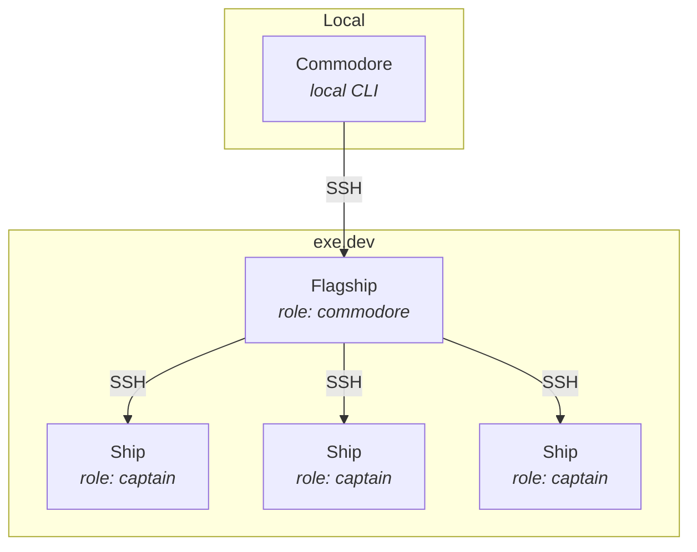

# ocaptain

[](https://www.gnu.org/software/bash/)
[](https://exe.dev)

> O Captain! my Captain! our fearful Claude Code session is done, The repo has weather’d every rack, the prize we sought is won.

Minimalist multi-agent control plane built on top of [exe.dev](https://exe.dev) VMs. Just under 800 lines of bash code.

Inspired by Steve Yegge's [Gas Town](https://github.com/steveyegge/gastown), this is going to be one of approximately 40,000 coding agent orchestration tools in 2026. Spiritual successor to [claudetainer](https://github.com/smithclay/claudetainer).

## Install

```bash
brew install smithclay/tap/ocaptain
```

## Quick Start

```bash
# Add optional Github and Claude credentials to .env:
# 1) Create a long-lived Claude Code token to use it in your VMs: `claude setup-token`
# 2) Create a Github PAT at github.com/settings/personal-access-tokens
cp .env.example .env

# Bootstrap the flagship
ocaptain init

# Create an empty ship
ocaptain ship ahoy-hoy

# Create a ship with a git repo checked out to ~ (requires GH_TOKEN in .env)
ocaptain ship create owner/repo

# SSH into ships
ocaptain ship ssh ahoy-hoy
```

## CLI Commands

```bash
ocaptain help

# Check fleet status
ocaptain fleet status

# Sink a ship
ocaptain ship sink reponame

# Destroy all ships (direct cleanup; bypasses flagship)
ocaptain fleet sink

# Destroy everything (ships + flagship, direct cleanup)
ocaptain fleet sink --scuttle
```

## Architecture



The same `ocaptain` script runs everywhere. Identity is determined by `~/.ocaptain/identity.json`:
- **local** (no identity file): Commands proxy to flagship via SSH
- **commodore**: Commands execute directly on the flagship
- **captain**: Commands execute directly on ships

## Cloud Init

The `cloudinit/` directory contains the initialization script that runs on both flagship and ship VMs. The script (`init.sh`) sets up a development environment with:

- Base packages (git, curl, zsh)
- GitHub CLI with authentication
- Target repository cloned to `~/<repo-name>`
- Zellij terminal multiplexer
- Rust toolchain via rustup
- Oh My Zsh
- [Dotfiles via chezmoi](https://www.chezmoi.io/)
- NATS CLI for inter-ship communication

### Environment Variables

The init script accepts these environment variables:

| Variable | Required | Default | Description |
|----------|----------|---------|-------------|
| `GH_TOKEN` | Yes | - | GitHub PAT for authentication and repo access |
| `TARGET_REPO` | No | - | Repository to clone (e.g., `owner/repo`) |
| `INIT_PATH` | No | - | Local path to init script (scp'd to VMs, overrides `INIT_URL`) |
| `INIT_URL` | No | GitHub raw URL | Remote URL to init script |
| `DOTFILES_PATH` | No | - | Local dotfiles directory (scp'd to VMs, highest priority) |
| `DOTFILES_URL` | No | `https://github.com/smithclay/ocaptain` | Dotfiles repo URL (supports `/dotfiles` subdirectory) |
| `ROLE` | No | `captain` | Identity role: `captain` for ships, `commodore` for flagship |

### Customizing Init and Chezmoi Dotfiles

You can use local files or custom URLs for initialization:

```bash
# Use a local init script (scp'd to VMs)
INIT_PATH=./my-init.sh ocaptain init

# Use a custom remote init script
INIT_URL=https://example.com/my-init.sh ocaptain ship create owner/repo

# Use local chezmoi dotfiles directory (scp'd to VMs)
DOTFILES_PATH=./my-dotfiles ocaptain init

# Use a custom dotfiles chezmoi repo URL
DOTFILES_URL=https://github.com/user/dotfiles ocaptain ship create owner/repo
```

These can also be set in a `.env` file in the ocaptain directory.

## Inbox

Ships and the flagship communicate via NATS pub/sub over SSH tunnels. Run these commands on a ship (via `ocaptain ship ssh <ship-name>`):

```bash
# Send a command to another ship
ocaptain inbox send captain@other-ship "cargo test"

# Send a command to commodore
ocaptain inbox send commodore@flagship "echo 'Report from ship'"

# Get this node's identity
ocaptain inbox identity
```

### How It Works

- Fleet registry stored in `~/.ocaptain/ns/<namespace>/ships.json` (flagship only)
- Live VM state fetched from `ssh exe.dev ls -json`
- Messages delivered via NATS pub/sub over SSH tunnels
- The `ocaptain _scheduler` daemon subscribes to NATS and executes commands
- Results (stdout, stderr) are stored in the artifacts directory

## Contributions

Contributions seriously considered if they result in a reduction of the number of lines of code :)

## Requirements

- bash
- ssh
- scp
- jq
- exe.dev account with SSH access configured
